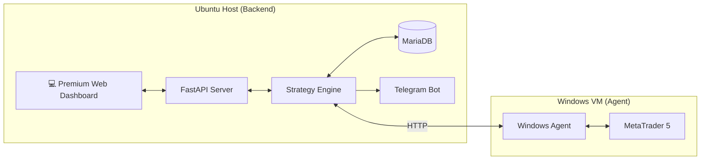

# MeanreversalRSI
A robust cryptocurrency trading bot implementing mean reversion and trend-following strategies using RSI, TMA, and Bollinger Bands. Built with Django, Celery, and CCXT.


A premium, distributed algorithmic trading system designed for **High-Probability Mean Reversal** on Crypto markets (BTC, ETH, DOGE). Based on the 813% ROI backtested strategy.

---

## 🏗️ Architecture

The system utilizes a **Client-Server** architecture to bridge the gap between your secure Ubuntu environment and the Windows-exclusive MetaTrader 5 terminal.



## 👨‍💻 Author
**Achu**
*(Originally forked, rewriten and enhanced by Achu)*

## 📜 License
MIT

---

## ✨ Features

-   **Premium Dashboard**: Glassmorphism UI with real-time charts, balance, and equity display.
-   **Multi-Asset Support**: Simultaneously trades BITCOIN, ETHEREUM, and DOGECOIN.
-   **Smart Risk Management**: Dynamic position sizing (default 5% risk per trade).
-   **Real-Time Alerts**: Instant Telegram notifications for every trade execution.
-   **Persistent Logging**: Full trade history stored in a MariaDB database.
-   **Robust Logic**: 
    -   **Mean Reversal**: 4H RSI Extremes + SuperTrend Confirmation + High ADX -> Limit Order.
    -   **TMA System**:
### 3. GOLD DEMASuTBB (New)
A specialized strategy for XAUUSD (GOLD) utilizing DEMA, SuperTrend, and Bollinger Bands.
- **Trend Filter**: 200 DEMA (Double Exponential Moving Average).
- **Signal**: SuperTrend (12, 3).
- **Exit**: Bollinger Bands (20, 2) Touch OR SuperTrend Flip.
- **Safety**: "Secret Tip" logic prevents entering if price is already at the Band extremes (overbought/oversold).
- **Timeframes**: 45m, 15m, 5m concurrently.

### 4. TMA (Triangular Moving Average)
 Trend + CMO Pullbacks + ADX Strength.

---

## 🛠️ Installation & Setup

### 1. Windows Agent (The Bridge)
*Run this on your Windows VM where MT5 is installed.*

1.  **Install Python**: Download & Install Python 3.10+ for Windows.
2.  **Setup Agent**:
    -   Copy the `windows_agent` folder to your VM.
    -   Open CMD in that folder.
    -   Install dependencies: `pip install -r requirements.txt`
3.  **Run Agent**:
    ```cmd
    python agent.py
    ```
    > 📝 **Note**: Keep this window open. Note down the IP address displayed (e.g., `192.168.122.121`).

### 2. Backend System (Ubuntu)
*Run this on your main Linux machine.*

1.  **System Requirements**:
    ```bash
    sudo apt-get update
    sudo apt-get install -y mariadb-server libmariadb-dev
    ```
2.  **Environment Setup**:
    ```bash
    # Create virtual env
    python3 -m venv venv
    source venv/bin/activate
    
    # Install dependencies
    pip install -r backend/requirements.txt
    pip install mariadb python-telegram-bot
    ```
3.  **Database Setup**:
    ```bash
    sudo mysql -e "CREATE DATABASE IF NOT EXISTS algo_trading; CREATE USER IF NOT EXISTS 'bot_user'@'localhost' IDENTIFIED BY 'bot_pass'; GRANT ALL PRIVILEGES ON algo_trading.* TO 'bot_user'@'localhost'; FLUSH PRIVILEGES;"
    ```

---

## ⚙️ Configuration

### 1. Connect to Windows Agent
1.  Start the dashboard:
    ```bash
    ./venv/bin/python -m backend.main
    ```
2.  Open **http://localhost:8000**.
3.  In **Settings**, enter your VM's IP: `http://192.168.122.121:8001`.
4.  Click **Update Configuration**.

### 2. Setup Telegram Alerts 📱
1.  Message your bot `@Acp3050` with `/start`.
2.  Run the helper tool to find your Chat ID:
    ```bash
    ./venv/bin/python -m backend.get_chat_id
    ```
3.  Copy the ID (e.g., `5998452008`).
4.  Update `backend/config.py`:
    ```python
    TELEGRAM_CHAT_ID: str = "5998452008"
    ```
5.  **Restart the backend** to apply changes.

---

## 🕹️ Daily Operations Guide

### How to Start the System
1.  **Open Terminal** in the project folder.
2.  **Run Command**:
    ```bash
    ./venv/bin/python -m backend.main
    ```
3.  **Open Dashboard**: Go to `http://localhost:8000`.
4.  **Click "Run All"**: This activates the bot. You will see a "Bot Started" alert on Telegram.

### How to Stop the System
1.  **Pause Trading**: Click **"Stop All"** on the Dashboard. This stops the bot from taking *new* trades.
2.  **Shutdown Server**: Go to your terminal and press `Ctrl+C`.

### How to Restart (After PC Reboot)
1.  Ensure your **Windows Agent** is running on the VM.
2.  Run the **Backend Command** (Step 2 above).
3.  Refresh the Dashboard and click **"Run All"**.
    > *The bot will automatically reconnect and send you a "Connection Restored" alert.*

---

## 🔮 Strategy Logic (The "Alpha")

This bot uses a confluence of 4 high-reliability indicators:
1.  **RSI (Relative Strength Index)**: Identifies Overbought (>70) or Oversold (<30) conditions on the **4-Hour** timeframe.
2.  **SuperTrend**: Ensures we only trade in the direction of the macro trend.
3.  **ADX**: Filters out choppy markets (Must be > 20).
4.  **Bollinger Bands**: Uses Mean Reversion to enter at the outer bands, betting on a return to the mean.
5.  **TMA Strategy**:
    -   **Trend**: Confirmed by Price > TEMA (Triple EMA).
    -   **Strength**: ADX > 25.
    -   **entry**: CMO (Chande Momentum Oscillator) Overbought/Oversold Pullback.

---

## 🆘 Troubleshooting

-   **"Connection Error"**: 
    -   Ensure Windows VM firewall allows port `8001`.
    -   Check if you can ping the VM from Ubuntu.
-   **"404 Error"**: 
    -   Check if the symbol names in `backend/config.py` match your MT5 Market Watch exactly (e.g., `BTCUSD` vs `BITCOIN`).
-   **"Mariadb Config Not Found"**:
    -   Ensure `libmariadb-dev` is installed.
    -   Run pip with config path: `MARIADB_CONFIG=/usr/bin/mariadb_config pip install mariadb`

---
*Created by Antigravity* 🚀
